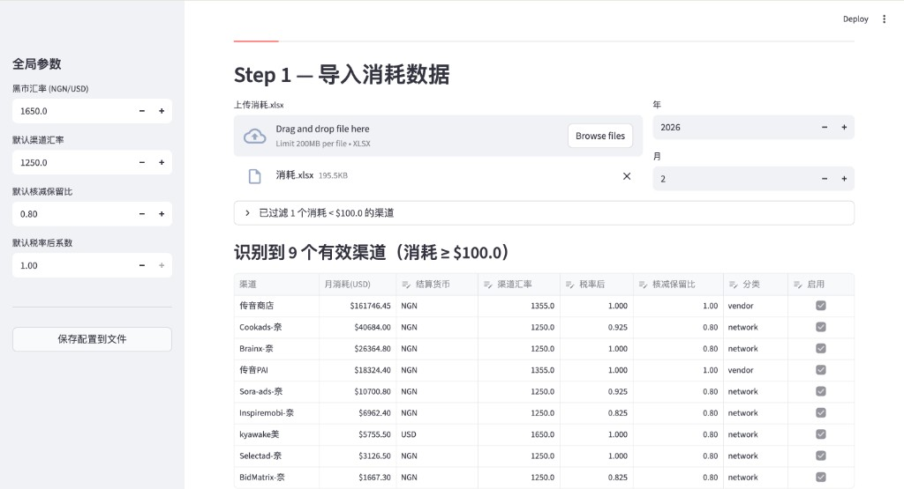
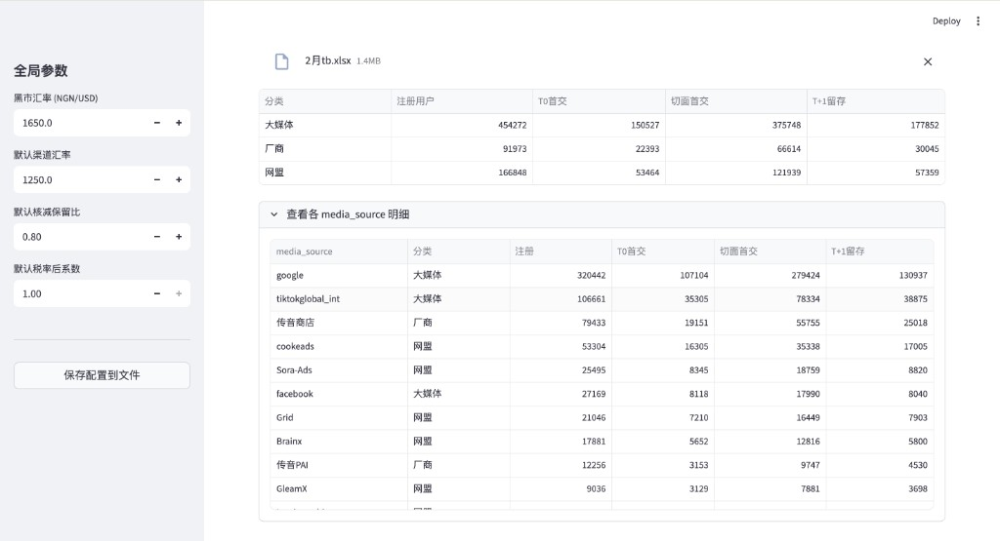
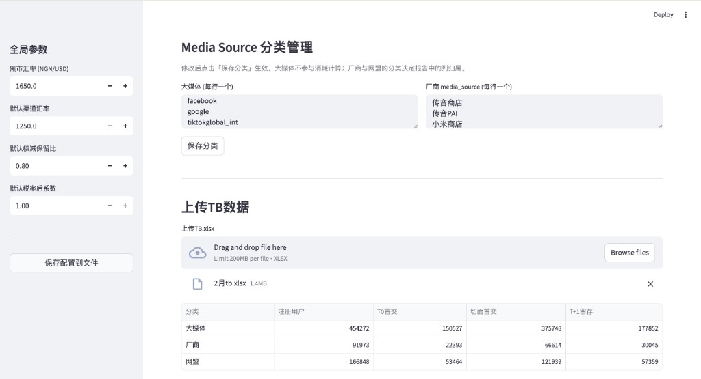
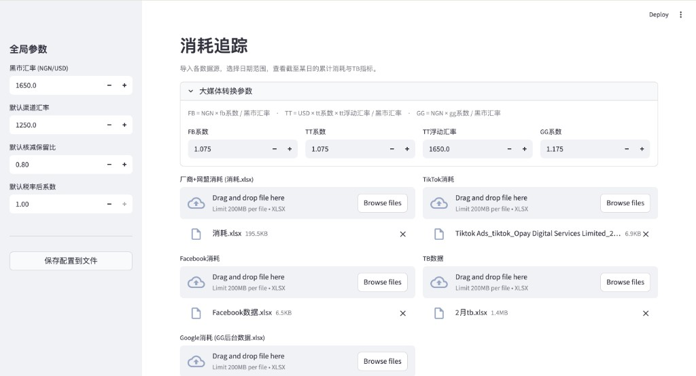
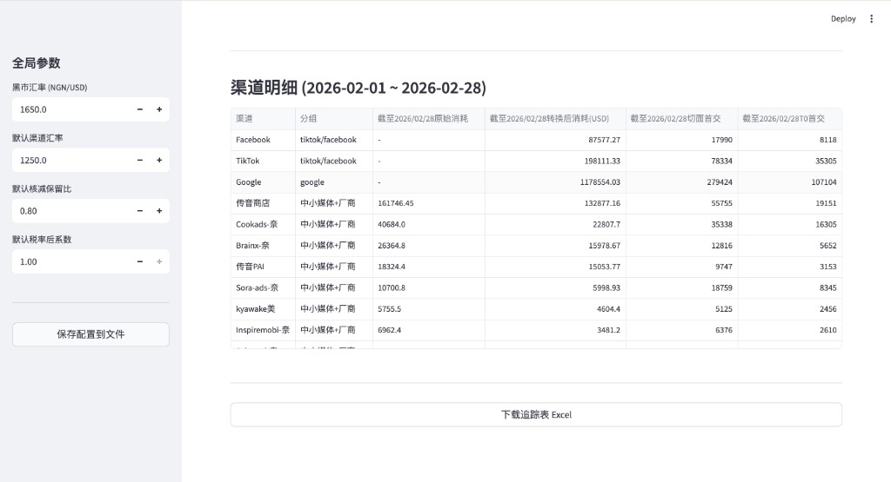

# 从实习里的模糊业务需求到 AI 小工具：一次「任务光谱」的实践

> 我在实习里遇到过一个很具体、但一开始非常模糊的问题：我们 App 的主要运营市场在尼日利亚，投放团队会在不同渠道维护不同的飞书在线表格和后台数据；而每个渠道在 App 里的注册、首交、留存表现，又沉淀在内部 TB 系统里。每次想核算某个渠道、或者追踪某段日期的投放效果，都要先确认日期范围，再去各处下载数据、重新聚合、重新分类、重新算一遍。

这个动作本身不难，难的是它**每次都要重复**。今天看 2 月 1 日到 2 月 7 日，明天可能又要看 2 月 1 日到 2 月 8 日；今天下载的是哪个时间点的数据、某个表有没有覆盖到这几天、某个渠道这次应该归到大媒体还是厂商，时间久了都会变成认知负担。最后人不是卡在某个复杂算法上，而是卡在一堆低价值但必须准确的操作里。

这篇文章记录的，就是我怎么把这个实习里的业务问题，拆成一个可以被 AI 辅助构建、但最终能稳定运行的小工具：业务同事上传几张表，调整少量参数，就能生成月报和消耗追踪结果。

但真正想分享的不是"我做了个工具"，而是中间那个**判断过程**——尤其是一个有点反直觉的结论：在这个问题里，最关键的一次 AI 决策，是**把 LLM 挡在运行时之外**。



*工具的第一个价值，是把分散在表格和人脑里的渠道规则，变成一张可复核、可调整的参数表。*

<!-- more -->

---

## 先别急着上 AI：这个实习问题到底在问什么

在业务现场，问题通常不会以"请你设计一个 ETL 系统"这种形式出现。它更像是："这个月报能不能自动算？""这些渠道规则能不能以后不用每次手改？""能不能做个界面让不懂代码的人也能用？"

这些听起来都像是在问"能不能用 AI 做一个工具"。但如果你顺着这句话直接去想"那我写个 prompt，把 Excel 丢给大模型让它帮我算"，几乎一定会做出一个**不稳定**的东西——它这个月算对了，下个月换一批数据就悄悄错给你看，而且你还查不出来它哪一步错了。对一个**财务口径**的计算来说，这是不可接受的。

所以我习惯先把问题换一种问法：

> **这件事里，哪些该交给程序（确定性），哪些该交给 AI（模糊/语义），哪些必须留给人（判断）？**

这就是我一直在用的一个心智模型——**任务光谱（task spectrum）**。一个需求很少是"纯 AI"或"纯人工"的，它通常是这三段的混合。Builder 的核心功夫，不是会调多牛的模型，而是**能把一个需求准确地切成这三段，再让每一段待在它最该待的地方**。

下面就用这个框架，把我实习里的这个广告投放月报问题拆开。

---

## 第一步：把"算账"还原成一条 ETL 链路

模糊需求的背后，往往藏着一条没有被显式说出来的流程。我做的第一件事，不是写代码，而是**找到那张承载了"隐性知识"的参考 Excel**，把业务同学在手工月报里默认执行的算法逆向出来。

还原之后，它本质上是一条经典的 **ETL（Extract–Transform–Load）**：

- **Extract（抽取）**：从各渠道日报里，取出某个月每个渠道的实际消耗。
- **Transform（转换）**：这是最复杂的一段，而且是**分层**的——
    1. 汇率换算：`消耗 × 渠道汇率 ÷ 黑市汇率`
    2. 扣税：`× 税率后系数`（渠道承担的 VAT）
    3. 核减：`× 核减保留比`（和渠道谈下来的折扣）
- **Load（装载）**：把每个渠道的结果，汇总成"大媒体 / 厂商 / 网盟"三类，输出成一张标准报表。

把它写成一个统一的式子，对每个渠道都是：

```text
最终成本(USD) = 原始消耗 × (渠道汇率 / 黑市汇率) × 税率后系数 × 核减保留比
```

我后来用 2 月的试跑数据跑了一遍，才真正感受到这个问题为什么不能靠手工长期维护：一个月的 `消耗.xlsx` 里能识别出 10 个渠道，其中 9 个渠道月消耗超过 100 美元；同一个月的 TB 数据里有 73 个不同的 `media_source`。这还只是一个月。如果每个月都靠人记住"这个渠道汇率是多少、那个渠道税率是多少、这个 media_source 归到哪一类"，迟早会出错。



*TB 不是只有一个总数。真正有用的是：先按业务口径聚合，再保留可追溯的 source 明细。*

!!! note "拆解的标准：能不能对应到不同的动作"
    拆链路不是越细越好。我判断"该不该再拆一层"的标准只有一个：**拆出来的两块，是不是对应着两个不同的处理方式**。汇率、税、核减之所以要分成三层，正是因为它们的"变与不变"完全不同（见下一节）——如果它们永远一起变，那分层就是多余的。

---

## 第二步：给每一块找它该待的位置

链路清楚之后，把它放到任务光谱上，三段就自然浮现了。

### 确定的部分 → 交给程序，不要交给 LLM

上面那条公式是**纯确定性**的。同样的输入永远得到同样的输出，对错有唯一标准。这种东西**天生属于程序**：写成几行 Python，既快、又准、又能复算（auditable）。

这里有个容易踩的坑：很多人会觉得"我都用 AI 了，这点乘除法当然也丢给大模型"。但**确定性计算交给 LLM 是纯粹的退步**——你用一个会幻觉、不可复算、还要花钱花延迟的东西，去替代一个本来 100% 可靠的乘法。

### 会变、但有规律的部分 → 做成"带默认值的配置"

接下来是真正麻烦的地方：**业务规则会变，而且每个渠道还不一样。**

- 传音（Transsion）不参与核减，核减保留比固定是 `1.0`；
- 大部分渠道汇率是 `1250`，但传音是 `1355.5`；
- 税率后系数大多是 `1.0`，但 COOKE 是 `0.925`、Inspire 是 `0.825`；
- 还有按美元结算的渠道（kyawake、Grid），它们根本没有汇率折算这一步。

如果把这些规则**硬编码**进程序，那这工具就是一次性的——下个月汇率一变就得改代码，业务同学根本没法自己维护。

所以这一段我没有写死，而是抽成了一份**配置（带合理默认值）**：

```yaml
global:
  black_market_rate: 1650     # 系统黑市汇率
  default_channel_rate: 1250  # 默认渠道汇率
  default_discount_ratio: 0.8 # 默认核减保留比

channels:
  传音商店:
    channel_rate: 1355.5
    discount_ratio: 1.0       # 传音不核减
  kyawake美:
    currency: USD
    channel_rate: 1650        # 美元结算：汇率=黑市汇率，相除即抵消
```

这里有个我挺满意的小设计：**美元结算渠道，我没有给它写一个 `if currency == 'USD'` 的特例分支，而是把它的渠道汇率默认设成黑市汇率本身。** 这样 `1650 / 1650 = 1`，汇率那一步自动抵消，公式对所有渠道**保持统一**。少一个分支，就少一处会出 bug、会让人困惑的地方。

把"会变的"和"不变的"分开，是这一步的灵魂：**不变的逻辑沉在代码里，会变的参数浮在配置上**。

### 需要判断的部分 → surface 给人，而不是替人拍板

总有一些东西，规则给不出答案，得人来定。比如：

- 这个月到底有哪些渠道要算（有些消耗几美元的可以直接忽略）；
- 某个渠道这次按什么参数；
- 某个媒体到底归到"厂商"还是"网盟"。
- 追踪数据要看到哪一天，因为业务经常不是等月底才看，而是要看"截至 2 月 7 日"、"截至今天"这种中间状态。

我的处理不是让程序（或 AI）替人决定，而是**把这些判断点全部暴露在界面上**：自动识别出消耗超过阈值的渠道，把每个渠道的参数用默认值填好、做成一张**可编辑的表格**，人想改就改、想删就删。

这正好呼应了那条原则——**AI / 程序的任务不是"替人拍板"，而是减少人要看的东西，并把最值得人看的东西摆到最前面。** 人不用从一百列 Excel 里大海捞针，只需要在一张已经填好默认值的表上，复核几个真正需要他判断的格子。



*大媒体、厂商、网盟的分类有默认值，但业务口径变化时，使用者可以自己改。*

---

## 后来我又加了一个追踪 Tab：因为业务不会只在月底发生

月报解决的是"月底结算"问题，但实习里的真实场景还有另一类需求：**过程中就要知道现在花了多少钱、效果怎么样。**

这件事如果继续用 Excel 会很麻烦。因为追踪不是固定看月底，而是经常会问：

- 2 月 1 日到 2 月 7 日花了多少？
- 截止今天，大媒体和中小渠道分别消耗多少？
- Google / Facebook / TikTok 的消耗分别在后台表里，TB 又是另一张表，能不能放在一起看？
- 如果今天看 2 月 7 日、明天看 2 月 8 日，是不是每次都要重新下载、重新透视、重新拼表？

所以我在 GUI 里单独做了一个**消耗追踪 Tab**。它一次导入五类文件：中小渠道消耗、Facebook、Google、TikTok、TB。用户只需要选开始日期和截止日期，工具就会在同一个页面里把消耗和首交指标拼出来。



*追踪 Tab 解决的不是"读一张表"，而是把多个后台和飞书表的数据，在一个可选日期范围里重新对齐。*

这一步真正的痛点，不是"读 Excel"本身，而是**不同来源的时间口径不一样**。我用试跑数据跑的时候就发现：

| 数据源 | 日期范围 |
|---|---|
| 中小渠道消耗 | 2023-04-03 到 2026-03-03 |
| Facebook | 2026-02-01 到 2026-02-28 |
| Google | 2022-08-01 到 2026-02-28 |
| TikTok | 2026-02-01 到 2026-02-28 |
| TB | 2026-02-01 到 2026-02-28 |

如果不做校验，一个很隐蔽的问题就会出现：你以为自己在看"2 月 1 日到 2 月 7 日"，但某个数据源其实没有覆盖这个区间，最后结果看起来有数，实际上口径已经歪了。所以我给追踪 Tab 加了日期覆盖提示：某个文件在所选日期里没有数据，或者只覆盖了一部分天数，界面会直接提示出来。

我也把追踪分成了两种视图：

- **明细视图**：看到每个渠道 / source，适合排查问题；
- **聚合视图**：汇总成 `tiktok/facebook`、`google`、`中小媒体+厂商`，适合给业务看。

用 2 月 1 日到 2 月 7 日的试跑数据跑出来，一个聚合结果大概是这样（金额做了四舍五入）：

| 分组 | 转换后消耗（USD） | 切面首交 | T0 首交 |
|---|---:|---:|---:|
| tiktok/facebook | 约 78.6K | 27,696 | 13,299 |
| google | 约 347.6K | 72,396 | 27,985 |
| 中小媒体+厂商 | 约 53.0K | 50,699 | 20,488 |



*聚合视图适合汇报，明细视图适合排查。两者切换，才是真正贴合业务使用的形态。*

这里面还藏着一个产品细节：**分类必须可配置**。TB 里的 `media_source` 不是天然就知道自己属于"大媒体"、"厂商"还是"网盟"。比如 `facebook`、`google`、`tiktokglobal_int` 是大媒体；传音、小米是厂商；剩下的大多归网盟。这个判断有默认值，但不能写死，因为业务口径可能会变。所以我把分类也做成了配置区：默认填好，业务同学需要时可以改。

这就是我对这个 Tab 的理解：它不是一个"多读几张表"的功能，而是在把一个动态的业务问题产品化——**日期是可选的，分类是可调的，参数是可改的，口径有校验，结果能在明细和聚合之间切换。**

---

## 反直觉的结论：最关键的 AI 决策，是把 LLM 挡在运行时之外

走到这里，整个工具里**运行时没有一行调用大模型**。它就是"程序做确定性计算 + 配置承载可变规则 + 人做最终复核"。

那这还算"AI 工具"吗？

我觉得这恰恰是最值得讲的一点。判断**要不要在运行时用 LLM**，我用三个维度：

| 维度 | 这个问题的答案 | 结论 |
|---|---|---|
| 任务是语义的，还是确定性的？ | 纯确定性（乘除法） | 不需要 LLM |
| 算错了代价多大？ | 财务数据，错了直接亏钱 | 不能容忍幻觉 |
| 对错能否低成本验证？ | 能，有唯一正确答案 | 更该用确定性程序 |

三个维度全部指向"别在运行时用 LLM"。**明明能用 AI，却判断出这里不该用——这本身就是一次 AI 能力边界的判断，而且我认为它比"硬塞一个大模型进去"要成熟得多。**

那 AI 在哪？**AI 的角色是 builder，不是 runtime。** 真正用大模型的地方，是**构建这个工具的过程本身**：把实习里那个模糊的业务需求、那张缠绕的 Excel、以及不断补充的渠道规则，一步步翻译成结构化的代码、配置和界面。它是"翻译官"和"施工队"，不是"算账先生"。

> 区分 **build-time AI** 和 **run-time AI**，是我从这个小项目里收获最大的一条。很多"AI 落地"之所以不稳，是因为把本该在 build-time 用一次的 AI，错放到了每次运行都要赌一把的 run-time。

---

## 怎么证明它算对了：哪怕是确定性工具，也需要"标准答案"

工具能跑 ≠ 工具算对。所以最后一步，是**评测**。

确定性工具的评测，反而比 AI 系统更干净：它有**唯一正确答案**。我手里正好有一份以前手工计算、且已被业务采用的结果表，于是它就成了我的 **golden dataset（标准答案集）**。我让工具跑同一个月的数据，把输出和这张表**逐格比对**。

- 完全对得上的，说明逻辑还原正确；
- 对不上的，要么是我哪一层公式错了，要么是某个渠道的特例没覆盖到——每一处不一致，都是一条要回去修的线索。

这件事让我意识到：**"我觉得它对" 和 "我能用一张标准答案证明它对"，是两个完全不同的工程成熟度。** 哪怕是最简单的确定性工具，没有这一步，你都不敢把它交给别人用。

---

## 最后一公里：让不懂代码的人也能用

工具自己能跑，离"别人能用"还差很远。实习里的真实使用者是业务同学，不一定懂代码，让他们去敲 `streamlit run` 是不现实的。

所以我又补了两段，把"最后一公里"铺平：

- 把命令行版本升级成一个**网页界面**（拖文件、点按钮、下载报表），不碰任何代码；
- 写了一个 macOS 上**双击即可运行**的启动脚本，自动建环境、装依赖、起服务、开浏览器——第一次用的人什么都不用配置。

这一步没什么技术含量，但它是"一个 demo"和"一个真的有人在用的产品"之间的分界线。**能不能被一个完全不懂技术的人独立用起来，是检验落地的最硬标准。**

---

## 收口：一个可复用的判断框架

回头看，这个小工具真正可复用的，不是那几行汇率公式，而是面对"能不能用 AI 做 X"时的那套拆解动作：

1. **先把模糊需求还原成一条清晰的链路**（这里是 ETL）；
2. **把链路铺到任务光谱上**：确定的归程序，会变的归配置，要判断的 surface 给人；
3. **判断 LLM 该在 build-time 还是 run-time**——很多时候，最好的答案是"运行时根本不用"；
4. **用一份标准答案证明它真的对**；
5. **再花力气铺平最后一公里**，让不懂技术的人也能独立用起来。

一句话总结，还是那句老话，但我现在更信它了：

> **确定的自动化，不确定的智能化，关键判断留给人。**

而 builder 的价值，就在于**准确地划出这三者的边界**。

---

*这是我第一个真正用在实习工作场景里的 AI build。写下来，是为了复盘一次把模糊业务需求拆成可交付 AI-assisted workflow 的过程。*
