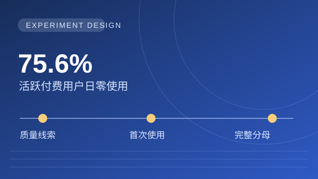
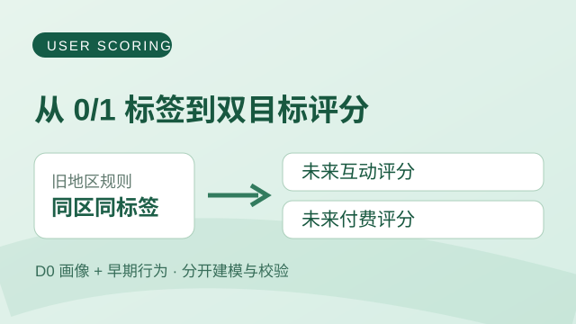
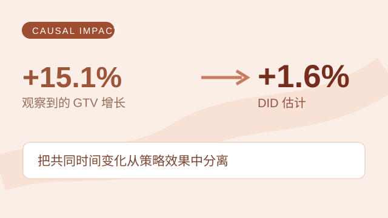

---
hide:
  - navigation
  - toc
---

数据分析 / 数据科学 · 作品集

# 齐昊宇

从业务信号出发，找到值得验证的判断。

北交大信管在读。用 SQL、实验与建模分析增长和用户问题；每个案例提供数据、判断与局限。

[看代表案例 ↓](#selected-work){ .md-button .md-button--primary }
[联系我](mailto:1263046508@QQ.COM){ .md-button }

## 精选案例 {#selected-work}

{ .case-cover-link }

01 / 实验设计 · 因果判断

### [Super Like：验证首次使用策略](projects/feature-causal.md)

核心动作：分析使用分布，设计首次使用实验，锁定完整目标人群。

关键判断：Match 后质量只是线索；决策看全体目标用户的深聊增量。

[查看案例 →](projects/feature-causal.md)

{ .case-cover-link }

02 / 规则审计 · 预测建模

### [高价值用户：双目标评分](projects/is-great.md)

核心动作：审计地区规则，分别建模预测未来互动与付费。

关键判断：同地区用户仍有差异；互动与付费需要分别排序。

[查看案例 →](projects/is-great.md)

{ .case-cover-link }

03 / 准实验 · 商业权衡

### [ANR 优化：用 DID 估计效果](projects/anr-optimization.md)

核心动作：以未受影响设备为对照，用 DID 估计广告位调整的效果。

关键判断：GTV 观察增长 +15.1%，DID 估计约 +1.6%；再权衡广告点击损失。

[查看案例 →](projects/anr-optimization.md)

[查看全部项目 →](projects/index.md)

## 更多项目

增长拆解和渠道反作弊，也是我在实习中处理过的业务问题。

04 / 用户增长

### [Growth Accounting：拆解 MAU 的漏水桶](projects/growth-accounting.md)

用 Overlap Window 区分新增、回流、留存与流失，定位买量后的留存缺口。

05 / 渠道质量

### [广告渠道反作弊：36 个子渠道的同一种异常](projects/ad-channel-analysis.md)

从 CTIT / ITET 异常入手，跨平台校准，再拆解渠道转化漏斗。

## 文章与工具

项目之外的做法与反思，放在这里继续展开。

- [从模糊业务需求到 AI 小工具](blog/from-vague-need-to-ai-tool.md) · 渠道核算流程、界面与代码实现
- [用多 Agent 做一个 AI 反思产品](blog/ai-product-system.md) · 上下文组装、路由与评测

**想了解我的背景或讨论案例？** [查看背景与联系方式 →](about.md)

