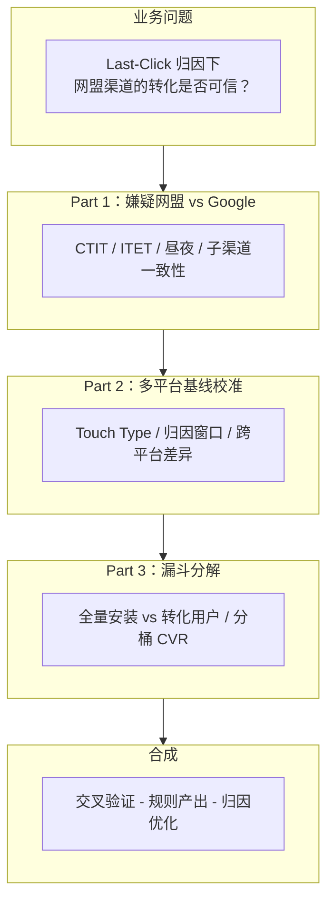
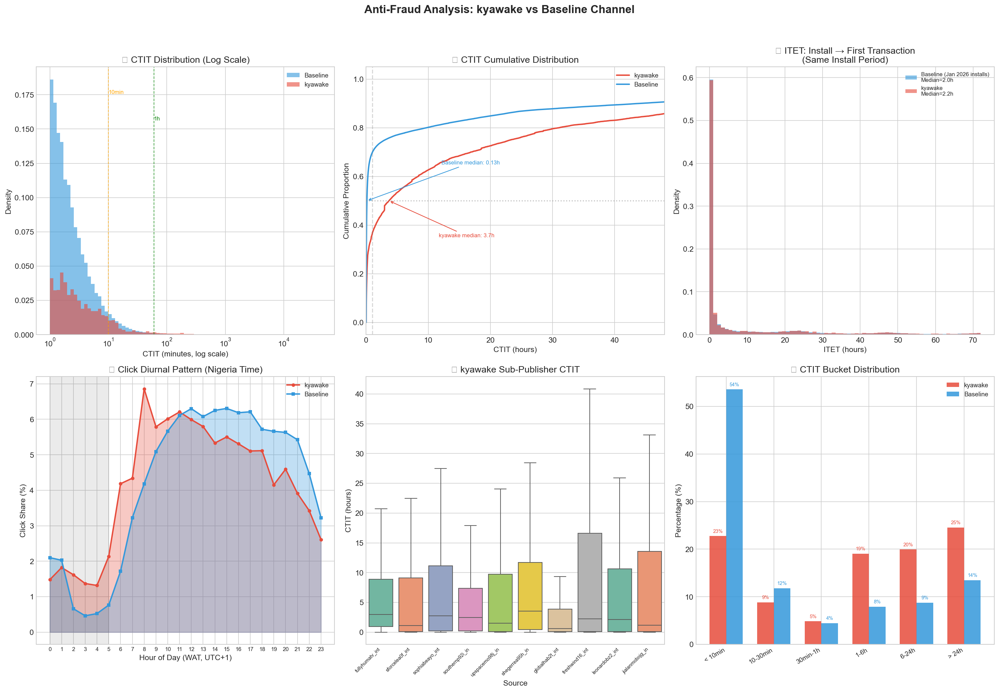
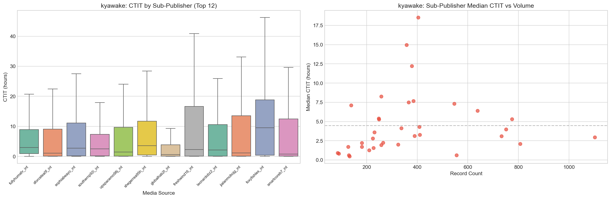
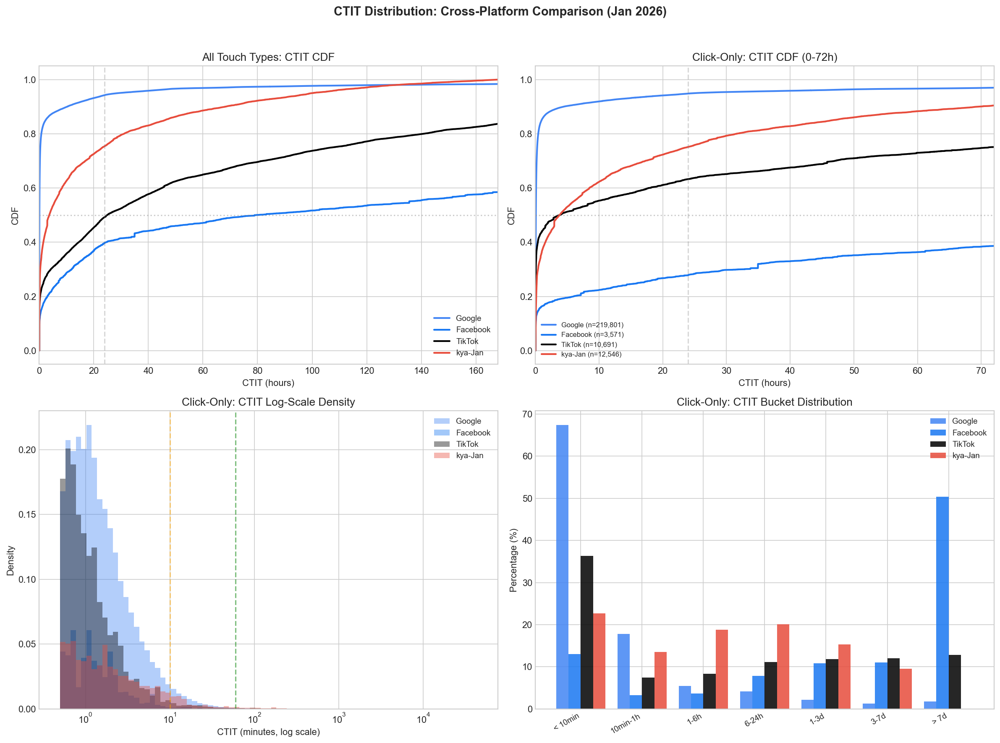
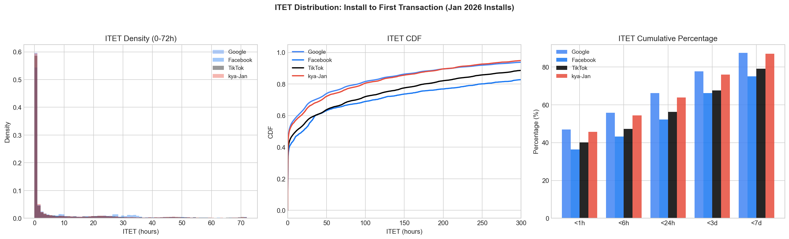
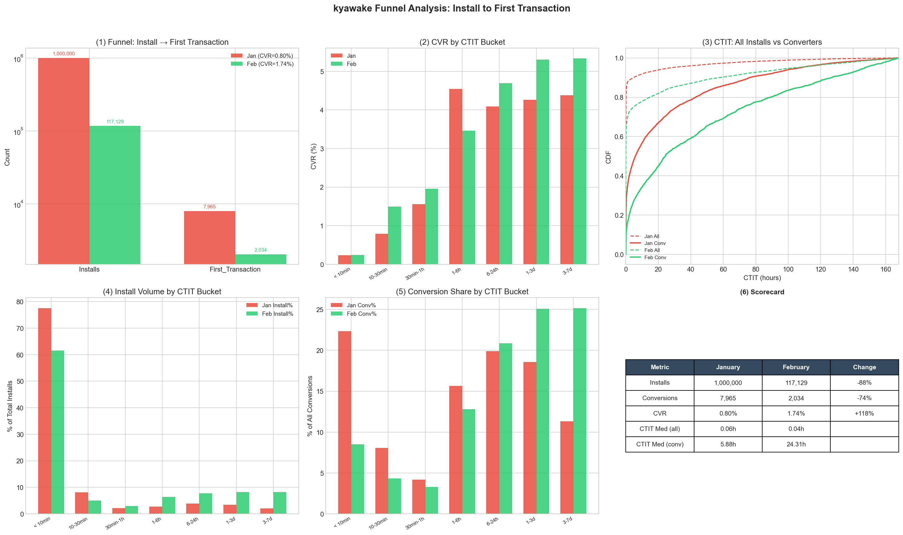
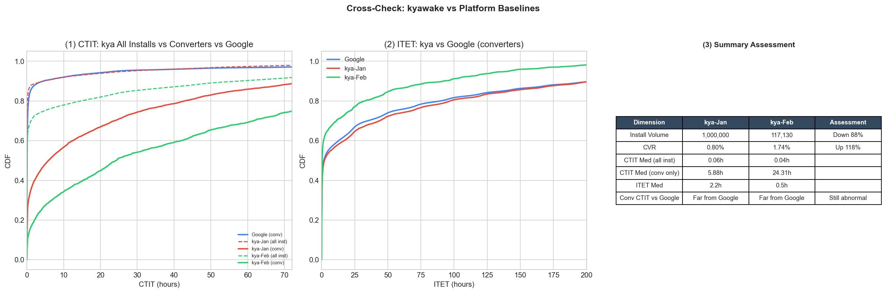
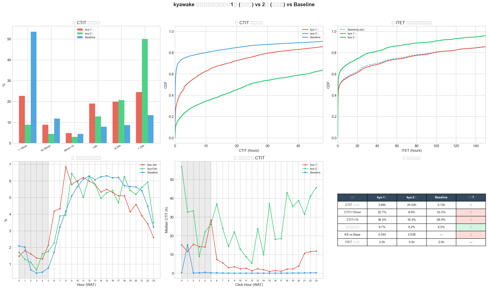

# 当 36 个子渠道呈现同一种异常：广告渠道反作弊特征分析

> **角色：** Data Analyst，移动支付 Fintech（尼日利亚市场）
> **工具：** Python (Pandas, Matplotlib/Seaborn)、AppsFlyer 原始数据、KS 检验
> **关键词：** Click Flooding, CTIT, ITET, 归因质量, 反作弊, EDA

---

## 摘要

在核查 AppsFlyer 平台数据时，我发现一个网盟渠道旗下 36 个子渠道的 Click → Install → First_Transaction 数量呈**异常阶梯状分布**——正常情况下，不同子渠道应有差异化特征。

我拉取了 Google Ads / Facebook / TikTok 及该网盟数月原始数据，从 **CTIT（点击-安装时间差）、ITET（安装-首次交易时间差）、昼夜节律、子渠道一致性** 四个维度进行 EDA，并引入多平台基线校准避免"唯 Google 论"。最终发现：

- 网盟 **CTIT 中位数是 Google 的 28 倍**，分布缺乏正常渠道的"头部聚集"特征
- 但转化用户的 **ITET 却与 Google 搜索用户几乎一致**（2.2h vs 2.0h）——行为像自然用户，不像被广告影响的新客
- 全量安装 vs 转化用户 CTIT 差 **98-608 倍**，短 CTIT 安装 CVR 仅 0.23%

产出反作弊规则，协助优化归因逻辑，将网盟渠道 **UAC 降低 20%**。

---

## 一、背景：阶梯状分布的异常

### 发现过程

在日常核查 AppsFlyer 后台数据时，我注意到一个反常现象：某高怀疑度网盟下的**多个子渠道拥有非常相似的 Click → Install → First_Transaction 数量**。

正常来说，不同的子渠道代表不同的流量来源（不同的媒体、不同的广告主），它们的数据应该存在一定差异。而这种**阶梯状的均匀分布**暗示着一个统一的系统在人为分配流量。

### 分析框架

我收集了 AppsFlyer 数月原始数据，对可信渠道（Google / Facebook / TikTok）与嫌疑网盟进行系统性对比。核心分析框架：



### 三个核心度量

| 度量 | 回答什么问题 | 不受什么干扰 |
| :--- | :---------- | :---------- |
| **CTIT**（Click → Install） | 归因的点击和安装之间有没有因果关系？ | — |
| **ITET**（Install → First_Transaction） | 用户安装后的行为像不像被广告"塑造"出来的新客？ | 几乎不受归因机制影响，是"用户质量指纹" |
| **分桶 CVR** | 不同延迟段的安装，谁真正产生转化？ | 需要全量安装数据 |

---

## 二、核心发现：四维异常特征

### 2.1 CTIT：点击与安装之间缺乏因果关系

真实广告渠道中，用户点击广告后应在几分钟内完成安装，CTIT 分布应"头重尾轻"。

| 指标 | 嫌疑网盟 | Google（Baseline） |
| :--- | :------- | :----------------- |
| CTIT 中位数 | **3.68h** | **0.13h（≈8min）** |
| < 10min 占比 | 22.7% | 53.5% |
| KS 检验 | D=0.344, p≈0 | — |



网盟的 CTIT 中位数是 Google 的 **28 倍**，CDF 曲线近似线性上升——这是**随机/均匀分布**的特征，而非广告驱动的"点击即安装"模式。

### 2.2 ITET：转化用户行为像自然用户

| 指标 | 嫌疑网盟 | Google（同期） |
| :--- | :------- | :------------ |
| ITET 中位数 | **2.2h** | **2.0h** |

两者**几乎完全一致**。对比其他渠道：TikTok 的 ITET 为 10.6h，Facebook 为 19.2h。网盟转化用户的安装后行为不处于内容/社交渠道的区间，而是恰好与**最高意图的搜索型用户**一致。

### 2.3 昼夜节律：凌晨 CTIT 飙升

- 网盟凌晨点击占比 **9.7%**（Google 仅 4.9%），但安装分布与 Google 一致
- 凌晨时段中位 CTIT 飙升至 **10-30 小时**：凌晨发出的点击要等十几小时后才"撞上"一个安装

安装是真人行为，但**点击分布过于平坦** → 暗示全天候运行的脚本。

### 2.4 子渠道一致性：36 个"壳"

36 个子渠道名字各异，但**全部呈现相同的异常 CTIT 模式**，无一达到 Baseline 水平：

- 所有子渠道 CTIT < 10min 占比在 **14%-32%**，没有一个达到 Google 的 54%
- Kruskal-Wallis 检验 H=458.94, p≈0：有统计差异，但仅是程度差异，**方向完全一致**



---

## 三、多平台校准：避免"唯 Google 论"

CTIT 长不一定是作弊——不同渠道类型天然有不同特征。引入 Facebook 和 TikTok 建立分层基线：

| 渠道 | CTIT 中位（Click-only） | ITET 中位 | 渠道类型 |
| :--- | :---------------------: | :-------: | :------- |
| **Google** | 4min | 1.7h | 搜索意图型 |
| **TikTok** | 3.81h | 10.6h | 内容发现型 |
| **Facebook** | 171h | 19.2h | 社交被动型 |
| **嫌疑网盟** | 3.78h | **2.2h** | **？** |



**核心矛盾浮现：** 网盟的 CTIT 形似 TikTok（内容发现型），但 ITET 却形似 Google（搜索高意图型）。一个网盟的 ITET 比 Facebook/TikTok 快 5-10 倍——除非获取的用户**本就不是广告驱动的**。



KS 检验确认：网盟 ITET 与 Google 的距离（D=0.040）远小于与 TikTok（D=0.086）或 Facebook（D=0.141）的距离。

---

## 四、漏斗分解：揭示"两条 CTIT 世界"

当拿到**全量安装**数据（而非仅转化用户）后，发现了被掩盖的关键结构：

| 指标 | 1月全量安装 | 1月转化用户 |
| :--- | :--------- | :--------- |
| 数量 | 1,000,000 | 7,965 |
| **CTIT 中位数** | **0.06h (3.6min)** | **5.88h** |
| < 10min 占比 | 77.6% | 22.3% |

网盟全量安装的 CTIT 与 **Google 几乎一致**（0.06h vs 0.07h）——确实在产生快速安装。但这些安装的 CVR 极低：

| CTIT 桶 | 安装占比 | CVR |
| :------- | :------: | :-: |
| < 10min | 77.6% | **0.23%** |
| 1-6h | 2.7% | **4.54%** |
| > 1天 | 5.6% | **4.26%** |

**CVR 与 CTIT 呈正向阶梯关系**——CTIT 越长，CVR 越高。这与正常渠道**恰好相反**（正常渠道中即点即装的高意图用户 CVR 最高）。



### 混合模型

```
第一层：真实广告投放（占安装 60-78%）
  点击→快速安装（CTIT < 10min）
  但 CVR = 0.23% → 质量极差，用途是充安装量

第二层：有机转化劫持（占转化 50-75%）
  后台持续盲发点击 → 自然用户自行安装并交易时
  恰好在 7 天窗口内有点击记录
  CTIT 长（5-24h+），CVR 高达 4-5%
  用途是贡献"转化业绩"
```



---

## 五、整改效果评估：结构幻觉

2月要求网盟调整投放策略后：

| 维度 | 1月 | 2月 | 判定 |
| :--- | :-- | :-- | :--- |
| CTIT 中位数（转化用户） | 3.68h | **24.04h** | 恶化 554% |
| KS vs Baseline | 0.344 | **0.538** | 恶化 56% |
| 整体 CVR | 0.80% | **1.74%** | ↑ 但... |
| < 10min 桶 CVR | 0.23% | **0.24%** | **不变** |
| Top3 子渠道集中度 | 20.8% | **79.6%** | 异常集中 |



**CVR 翻倍是安装结构变化**（少投了 88 万低质安装），**不是用户质量提升**——短 CTIT 桶 CVR 从 0.23% 到 0.24%，几乎不变。

---

## 六、产出与影响

### 反作弊规则

基于分析结果，产出以下归因规则优化建议：

| 维度 | 规则 | 依据 |
| :--- | :--- | :--- |
| **CTIT 过滤** | 拒绝 CTIT > 24h 的点击归因 | 长 CTIT 转化高度暗示自然用户劫持 |
| **短 CTIT 过滤** | 拒绝 CTIT < 2s | 潜在 click injection |
| **Touch Type 拆分** | 对高 VTA 平台必须分开分析 | 避免 VTA 拉长 CTIT 造成误判 |
| **网盟惩罚系数** | 降低网盟渠道归因权重 | Last-Click 易被利用 |

### 分层行为基线（可复用）

| 渠道类型 | CTIT 中位参考 | ITET 预期 |
| :------- | :-----------: | :-------: |
| 搜索型（Google） | ~4min | ~1.7h（高意图） |
| 短视频型（TikTok） | ~3.8h | ~10.6h（中意图） |
| 社交型（Facebook） | ~171h | ~19.2h（低意图） |

### 商业影响

- 优化归因逻辑后，将网盟渠道 **UAC 降低 20%**
- 沉淀的监控框架（分桶 CVR、ITET 对比、子渠道离散度）可持续应用于新渠道评估

---

## 七、方法论讨论

### 分析边界

!!! warning "能证明什么 vs 不能证明什么"

    **能做到的：**

    - 刻画渠道行为特征并与多平台基线对比
    - 揭示"短 CTIT 不转化、长 CTIT 才转化"的反常结构
    - 提供可复用的监控框架

    **不能做到的：**

    - 仅凭 CTIT 长不能单独"定罪"（Facebook 中位 CTIT 达 7 天仍是正常渠道）
    - 短 CTIT CVR 极低也可能是投放策略差、素材质量低等非欺诈原因
    - 缺少停投实验（关停网盟后观察 Organic 变化），无法从因果层面证明"劫持"

### 最核心的"不可解释"点

即便完全承认广告效果可以滞后，以下组合仍然难以用正常渠道行为解释：

1. 78 万次快速安装的 CVR 仅 0.23%，**两个月完全一致**——如果广告在影响用户，快装人群不应该质量如此之差且毫无改善
2. 长 CTIT 转化用户的 ITET 与 Google 搜索用户几乎一致（KS D=0.04）——"被广告影响的用户"行为恰好和最高意图的搜索用户一样
3. 35 个子渠道各获得 3.7-4.0 万安装（CV < 0.1），流量分配的均匀度难以用多个独立来源解释

---

## 八、反思：作为 Portfolio 案例，这个项目展示了什么？

| 维度               | 本案例展示的能力                                                    |
| :----------------- | :----------------------------------------------------------------- |
| **发现问题的敏锐度** | 从 AppsFlyer 后台的阶梯状分布主动发现异常，而非等业务方提需求        |
| **EDA 工程能力**   | Python (Pandas) 处理多渠道、数月量级的原始日志数据                   |
| **多维度交叉验证** | 不依赖单一指标判断，四维度 + 四平台 + 漏斗分解逐层深入              |
| **分析客观性**     | 明确标注分析边界（能证明什么、不能证明什么），不过度推断              |
| **商业落地**       | 产出可执行的归因规则和监控框架，UAC 降低 20%                        |
