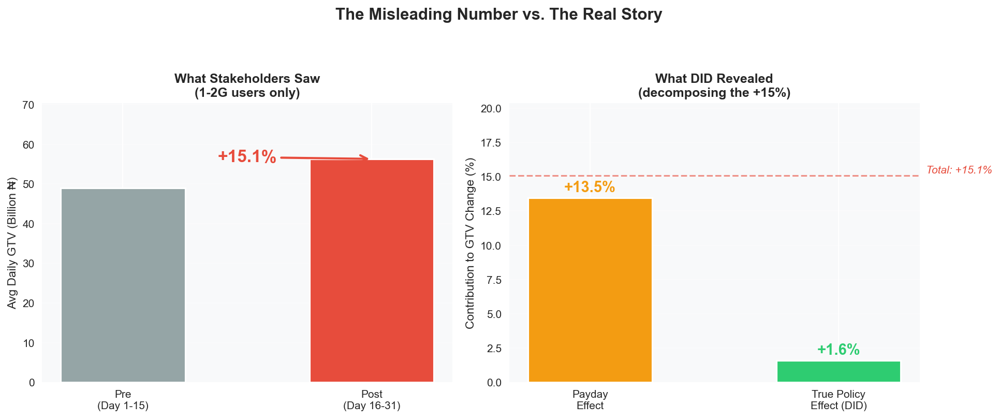
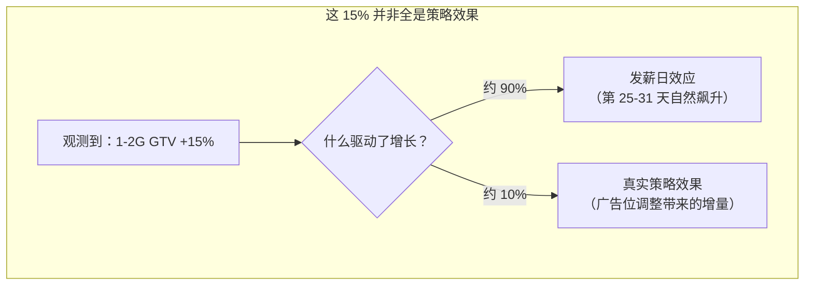
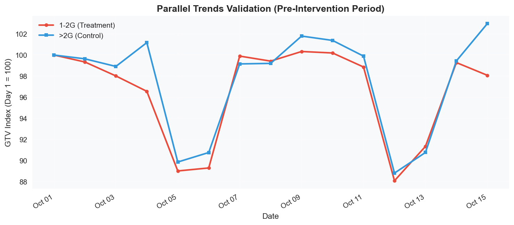
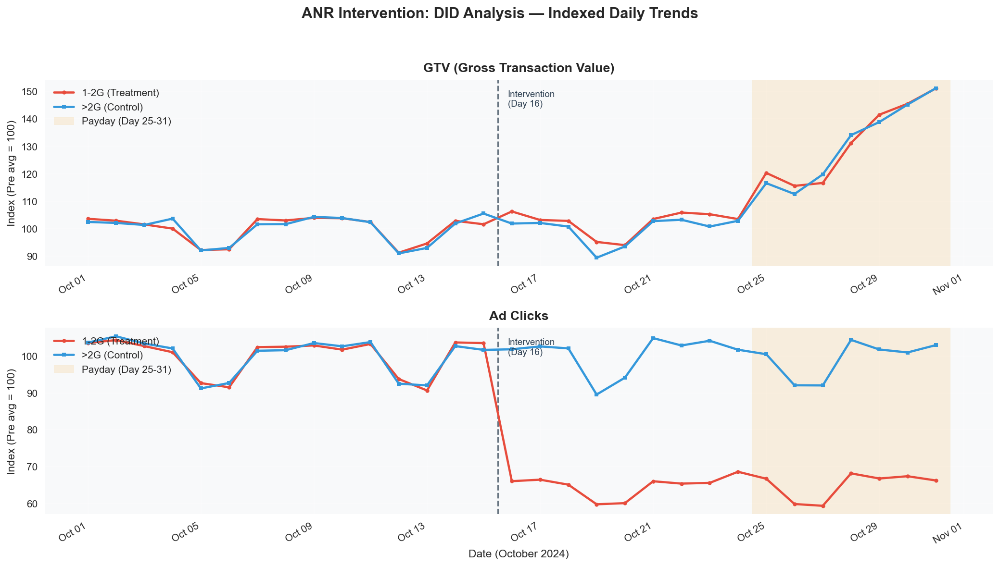
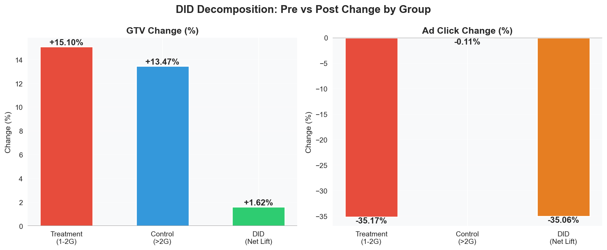
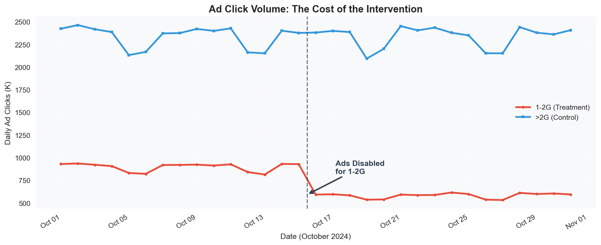
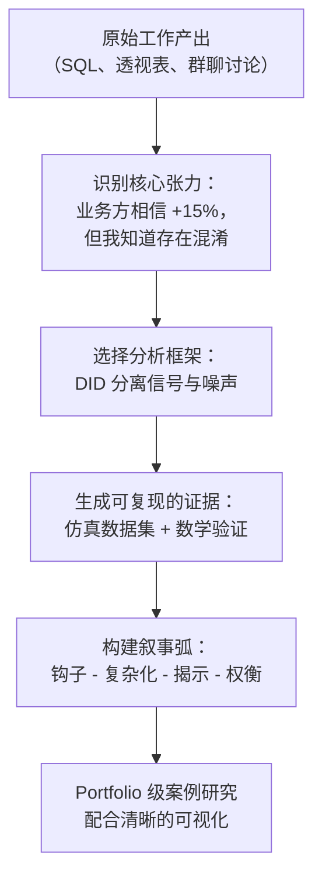

# 当 "+15% GTV" 只是海市蜃楼：用 DID 度量广告位策略调整的真实效果

> **角色：** Data Analyst，移动支付 Fintech（尼日利亚市场）
> **工具：** SQL (Hive/SparkSQL)、Python、Causal Inference (DID)
> **关键词：** Difference-in-Differences, Quasi-Experiment, Confounding, Causal Inference, A/B Test 替代方案

---

## 摘要

我们的移动支付 App 在低内存手机上存在一个已知性能问题：支付成功跳转页上的**高资源广告组件**会导致 1-2 GB 设备频繁触发 **ANR（Application Not Responding）**。流量分发团队决定为这部分设备**关闭特定高资源广告位**以改善用户体验，但策略以全局配置方式上线，没有条件做 A/B Test。

策略上线两周后，业务方看到 1-2G 用户的 **GTV 涨了 15%**，认为策略效果显著。

我用 **Difference-in-Differences (DID)** 方法证明了：**这 15% 的涨幅中，约 90% 是月底发薪日的季节性效应**，策略本身带来的真实因果增量仅为 **+1.6%**——与此同时，受影响广告位的点击量下降了约 **35%**。

这个分析将一个"大胜利"的叙事，重新框定为一场需要审慎权衡的成本-收益讨论。

---

## 一、背景：支付成功页的 ANR 问题

### 业务背景

我们的 App 服务于尼日利亚数千万用户，其中大量用户使用 **1-2 GB 内存**的低端手机。这些设备资源紧张，而 App 在支付成功跳转页上加载的部分营销广告组件（Rich Media 类型）占用了较高内存。

### 问题链条


涉及的广告位是 `pay_succ_rid_actransfer` 和 `pay_succ_rid_aatransfer`——它们加载在**支付成功后的跳转页**上。也就是说，ANR 发生时**交易本身已经完成**，不会直接导致当笔交易失败。

但问题在于：用户刚刚完成付款、正等待确认结果的敏感时刻，App 突然崩溃——这会损害用户对平台的信任感。

### 为什么值得关注

- **1-2G 用户**占活跃用户约 33%（DAU 占比显著）
- ANR 虽然不影响当笔交易，但在付款后最敏感的时刻发生崩溃，会引发用户焦虑（"钱到底扣了没有？"）
- 反复出现的卡顿体验会抑制**后续交易意愿**，并加速低端机用户流失（在尼日利亚市场，重新下载 App 的成本不低：流量贵、存储紧张）

---

## 二、策略调整：关闭特定广告位

### 我们做了什么

流量分发团队在**月度第 16 天**通过**服务端配置变更**，对 1-2G 设备做了针对性调整：

- **1-2G 设备：** 关闭支付成功跳转页上**两个特定高资源广告位**（`pay_succ_rid_actransfer`、`pay_succ_rid_aatransfer`，共 21 个 ad_id），**其余广告位正常展示**
- **>2G 设备：** 无任何变化，所有广告正常展示

### 为什么没做 A/B Test？

这次调整以服务端全局配置的方式上线，没有条件进行随机实验：

| 挑战                | 细节                                                         |
| :------------------ | :----------------------------------------------------------- |
| **全局配置**        | 服务端按设备内存统一生效，没有设备级别的随机分流基础设施       |
| **高方差**          | GTV 方差极大；50/50 分流需要较长时间窗口才能达到统计显著性     |
| **事后评估**        | 策略已先行上线，我的任务是**事后评估**其因果效应               |

> **我的挑战：** 策略已经全量上线，没有随机对照组——如何从复杂的市场环境中隔离出这次配置变更的*因果*效应？

---

## 三、误导性的数字：业务方庆祝 "+15%"

策略上线两周后，业务团队做了一个简单的**前后对比**（1-2G 用户）：

| 时段             | 日均 GTV（₦ 十亿） |
| :--------------- | :-----------------: |
| 干预前（第 1-15 天）|       48.9         |
| 干预后（第 16-31 天）|      56.3         |
| **变化**          |    **+15.1%**      |

叙事迅速形成：*"关掉那些广告位效果明显，直接释放了 15% 的 GTV 增量！"*



### 我为什么不买账

我知道一件前后对比无法解释的事情：**月底发薪日效应（Payday Effect）**。

在尼日利亚（以及许多新兴市场），工资发放集中在**每月 25-31 号**。这会在所有用户中产生一波巨大的、可预测的交易量飙升——**与设备内存无关**。



策略生效的时间窗口（第 16-31 天）与发薪日时段（第 25-31 天）**完全重叠**。任何朴素的前后对比，都会把策略效果和季节性效应**混为一谈**。

---

## 四、分析框架：Difference-in-Differences (DID)

### 为什么选择 DID？

**Difference-in-Differences** 是一种准实验方法，专门用于无法进行随机实验时估计因果效应。它的核心思想是找到一个**天然对照组**——经历了相同外部环境，但没有被干预。

| 分组           | 干预前（第 1-15 天）       | 干预后（第 16-31 天）                    | 角色        |
| :------------- | :------------------------ | :--------------------------------------- | :---------- |
| **1-2G 设备**  | 正常展示所有广告            | **特定高资源广告位被关闭**，其余正常       | Treatment   |
| **>2G 设备**   | 正常展示所有广告            | 无变化，所有广告正常展示                   | Control     |

核心公式：

\[
\text{DID} = \underbrace{(\bar{Y}_{T,post} - \bar{Y}_{T,pre})}_{\text{实验组变化}} - \underbrace{(\bar{Y}_{C,post} - \bar{Y}_{C,pre})}_{\text{对照组变化（仅含发薪日效应）}}
\]

对照组的变化量捕获了**反事实（Counterfactual）**——即如果不做任何干预，1-2G 用户的 GTV 会如何变化。将其减去后，我们就能隔离出纯粹的策略效果。

### 关键假设：Parallel Trends（平行趋势）

DID 要求两组在**不受干预的情况下**会遵循相同的趋势。我通过检验干预前时段来验证这一假设：



在第 1-15 天（干预发生之前），两组的 GTV 指数几乎完美同步——周末一起下跌，工作日一起回升。这验证了 **Parallel Trends 假设**成立，>2G 用户可以作为有效的 Control Group。

---

## 五、核心结果：从噪声中分离信号

### DID 2×2 矩阵

|                       | 干预前（第 1-15 天）| 干预后（第 16-31 天）| Δ 变化率   |
| :-------------------- | :-----------------: | :------------------: | :--------: |
| **Treatment（1-2G）** |    ₦48.9B/天        |     ₦56.3B/天        | **+15.1%** |
| **Control（>2G）**    |   ₦126.7B/天        |    ₦143.7B/天        |  +13.5%    |
|                       |                     |                      |            |
| **DID（Net Lift）**   |                     |                      | **+1.6%**  |

### 全景图



**GTV 面板（上）解读：**

- **第 1-15 天：** 两组走势完全同步（Parallel Trends ✓）
- **第 16-24 天：** 轻微分叉，但肉眼难以区分
- **第 25-31 天（发薪日区域，阴影部分）：** 两条线**一起暴涨**——这就是让朴素对比产生 15% 假象的混淆因素

**广告点击面板（下）解读：**

- **第 16 天：** 1-2G 的广告点击量出现**显著下跌**（被关闭的广告位约占总量三分之一）——策略精准生效
- **>2G：** 完全平稳——确认配置变更只作用于目标人群

### DID 分解



| 指标         | Naive（仅看 1-2G）  | DID（Net Lift）     | 解读                                                              |
| :----------- | :------------------: | :-----------------: | :---------------------------------------------------------------- |
| **GTV**      | +15.1%               | **+1.6%**           | 真实因果增量比朴素数字**小了 10 倍**                                |
| **Ad Click** | -35.2%               | **-35.1%**          | 与朴素值几乎一致——证实这是纯策略效应，不受季节性影响               |

---

## 六、权衡：这笔账到底值不值？

DID 分析把讨论焦点从"我们赚了多少？"重新框定为**"我们付出了什么代价？"**

### 广告位关闭的代价



| 指标                      | 调整前         | 调整后          | 影响                     |
| :------------------------ | :------------- | :-------------- | :----------------------- |
| 1-2G 日均广告点击          | ~898K          | ~582K           | **-35%（-316K/天）**      |
| 1-2G 日均 GTV（因果增量）  | ₦48.9B         | ~₦49.7B         | **+1.6%（+₦0.8B/天）**   |

### 最终建议

!!! success "核心结论"
    此次策略调整缓解了支付成功页的 ANR 问题，并带来了微弱的 GTV 改善（+1.6%），但代价是被关闭广告位约 35% 的点击量损失。**长期建议不是永久关闭这些广告位，而是用轻量化方案替换重型广告组件（静态 Banner、懒加载素材），在维持低内存设备稳定性的同时恢复广告收入。**

这个分析将后续路线图从"保持广告位关闭"转向了"让广告组件变轻"。

---

## 七、SQL 实现

DID 2×2 矩阵可以直接在 SQL 中计算（兼容 Hive / SparkSQL）：

### 查询一：生成 2×2 DID 矩阵

```sql
WITH did_matrix AS (
    SELECT
        device_memory,
        CASE WHEN day < 16 THEN 'Pre' ELSE 'Post' END  AS period,
        COUNT(*)                                         AS n_days,
        ROUND(AVG(gtv), 0)                               AS avg_daily_gtv,
        ROUND(AVG(ad_click), 0)                           AS avg_daily_ad_click,
        SUM(gtv)                                          AS total_gtv,
        SUM(ad_click)                                     AS total_ad_click
    FROM anr_simulated
    GROUP BY
        device_memory,
        CASE WHEN day < 16 THEN 'Pre' ELSE 'Post' END
)
SELECT * FROM did_matrix
ORDER BY device_memory, period DESC;
```

### 查询二：一行输出 DID 结论

```sql
WITH did_matrix AS (
    SELECT
        device_memory,
        CASE WHEN day < 16 THEN 'Pre' ELSE 'Post' END AS period,
        AVG(gtv)      AS avg_gtv,
        AVG(ad_click) AS avg_ad
    FROM anr_simulated
    GROUP BY 1, 2
)
SELECT
    ROUND(100.0 * (
        MAX(CASE WHEN device_memory='1-2G' AND period='Post' THEN avg_gtv END) /
        MAX(CASE WHEN device_memory='1-2G' AND period='Pre'  THEN avg_gtv END) - 1
    ), 2) AS naive_gtv_pct,

    ROUND(100.0 * (
        MAX(CASE WHEN device_memory='>2G' AND period='Post' THEN avg_gtv END) /
        MAX(CASE WHEN device_memory='>2G' AND period='Pre'  THEN avg_gtv END) - 1
    ), 2) AS control_gtv_pct,

    ROUND(100.0 * (
        MAX(CASE WHEN device_memory='1-2G' AND period='Post' THEN avg_gtv END) /
        MAX(CASE WHEN device_memory='1-2G' AND period='Pre'  THEN avg_gtv END)
      - MAX(CASE WHEN device_memory='>2G'  AND period='Post' THEN avg_gtv END) /
        MAX(CASE WHEN device_memory='>2G'  AND period='Pre'  THEN avg_gtv END)
    ), 2) AS did_gtv_net_lift_pct
FROM did_matrix;
```

---

## 八、方法论讨论与局限性

### 为什么选 DID 而非其他方法？

| 方法                       | 是否考虑过？ | 理由                                                                     |
| :------------------------- | :----------: | :----------------------------------------------------------------------- |
| **A/B Test**               | 首选方案      | 不可行——全局配置无法设备级随机分流 + GTV 高方差需要长窗口                   |
| **DID**                    | **最终采用**  | 设备内存天然划分 Treatment/Control；Parallel Trends 假设成立              |
| **Regression Discontinuity** | 考虑过      | 没有清晰的 Running Variable（天数不够平滑）                               |
| **Synthetic Control**      | 考虑过        | 对于两组明确定义的对比而言过于复杂；DID 可解释性更强                       |
| **CUPED**                  | 考虑过        | 适用于 A/B Test 中的方差缩减，此场景不适用                                |

### 局限性

1. **无个体层面随机化** — DID 识别的是 ATT（Average Treatment Effect on the Treated），而非 ATE
2. **干预后时间窗较短** — 仅 16 天；长期效果（用户留存、重新激活）未被捕获
3. **潜在溢出效应** — 如果 1-2G 用户因不再看到广告而改变了行为，进而影响 >2G 用户的指标，则 Control Group 会被污染（可能性低但存在）
4. **发薪日效应的形状假设** — 发薪日对两组的影响幅度可能不完全一致；我假设按比例相似，Parallel Trends 支持这一点但无法完全保证

---

## 九、反思：我是如何构建这个故事的

### 从零散笔记到完整的案例研究

这个项目最初只是一堆凌乱的工作记录——SQL 查询、数据透视表、以及一句感慨：*"ANR 这件事这么对比其实参考价值不大……到月底本身就有流量高峰期"*。

那句沮丧的观察，实际上就是整个 DID 分析的**种子**——我意识到了问题所在（发薪日混淆），接下来需要的只是一个严谨的框架来证明它。

以下是我将零散工作产出转化为结构化叙事的过程：



### 我使用的 Storytelling 原则

**1. 用令人震惊的数字开头，然后拆解它。**
> "+15%" 就是钩子。它之所以引人入胜，是因为它是*错的*——而展示它为什么错，才能体现分析的深度。

**2. 让混淆因素变得"肉眼可见"。**
> 发薪日效应在这个故事里不是抽象的统计概念——它是一个具体的、人尽皆知的市场行为。任何在 Fintech 或新兴市场工作过的人都会立刻产生共鸣。

**3. 用 Control Group 制造"顿悟时刻"。**
> 当你展示 >2G 用户在没有任何干预的情况下*也涨了 13.5%*，听众会瞬间意识到策略几乎没有撬动什么。这就是叙事的转折点。

**4. 不隐藏代价。**
> 广告点击量 -35% 不是脚注——它是第二个重要发现。分析的完整性取决于你是否呈现了账本的两面。这展示的是商业成熟度，而非仅仅是技术能力。

**5. 以建议结尾，而不仅仅是发现。**
> "让广告变轻"是可执行的。它表明我不只是在做数学——而是将分析连接回了产品决策。

### 作为 Portfolio 案例，这个项目展示了什么？

| 维度               | 本案例展示的能力                                                      |
| :----------------- | :-------------------------------------------------------------------- |
| **因果推断思维**   | 在无随机化条件下识别并处理 Confounding                                 |
| **方法选型**       | 在朴素方法（前后对比）和复杂方法（Synthetic Control）之间选择最合适的 DID |
| **挑战业务认知**   | 用严谨证据有策略地反驳 "+15%" 的叙事                                    |
| **商业判断力**     | 将结果框定为权衡（GTV vs. 广告收入），而非单一数字                       |
| **沟通表达**       | 将统计概念翻译为直观的、可视化的论证                                     |

---

## 附录：仿真数据集生成说明

本案例使用的数据集为**仿真数据**（保护商业机密），但经过**精确的数学校准**，可完美复现真实分析中的 DID 数学关系。

### 核心校准参数

| 参数                | 取值     | 作用                                                                     |
| :------------------ | :------- | :----------------------------------------------------------------------- |
| `PAYDAY_BOOST_GTV` | 30.9%    | 发薪日 GTV 涨幅（线性爬坡，均值 30.9%），作用于所有用户                    |
| `TREATMENT_GTV`     | +1.32%   | 关闭广告带来的真实 GTV 因果增量（仅作用于 1-2G，干预后）                   |
| `TREATMENT_AD`      | -35%     | 关闭特定广告位导致的广告点击量下降（被关闭位约占总量 1/3）                 |
| `WEEKEND_DIP`       | -7~10%   | 自然的周末活跃度下降（DAU、GTV、广告点击）                                |
| `NOISE_σ`           | 0.8~1.2% | 日级随机噪声，增加数据真实感                                              |

### 参数推导

上述参数由以下目标方程组联立求解：

\[
\begin{cases}
\text{Naive} = (1+\tau)\left(1 + \frac{7 \cdot \beta}{16}\right) - 1 = 0.15 \\[6pt]
\text{DID\%} = \tau \cdot \left(1 + \frac{7 \cdot \beta}{16}\right) = 0.015
\end{cases}
\implies \tau = \frac{0.015}{1.135} \approx 0.01322, \quad \beta = \frac{0.135 \times 16}{7} \approx 0.309
\]
