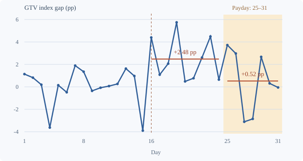

# 关掉广告后，+15% 的交易增长该怎么判断？

> **移动支付 · ANR 策略评估**　Hive / SparkSQL · DID · 交易与体验的取舍

低内存手机在支付成功页加载广告时容易卡顿。团队从第 16 天起，对 **1–2G 设备关闭两个广告位**。这可能改善体验，也减少了广告展示；交易能承受多大影响，需要和体验收益一起判断。上线后目标设备的日均 GTV 增长 **15.1%**，业务很自然地会问：这笔增长能算策略成果吗？

我的判断是先把交易口径修对，再找同期变化。未改配置的高内存设备也增长了 **13.5%**。在比例平行趋势假设下，两次差分得到完整窗口的估计为 **+1.62 个百分点**；发薪前与发薪周分别为 **+2.48、+0.52 个百分点**。我把这个交易结果与 ANR、后续支付和广告收入放在一起，判断关广告这笔取舍是否值得。

## 判断过程

点开每一步，看这次选择依据与改变结论的证据。

<input class="great-switch" type="radio" name="case-step" id="great-step-0" aria-label="返回决策摘要" checked>
<input class="great-switch" type="radio" name="case-step" id="great-step-1" aria-label="第1步：先定义这次取舍">
<input class="great-switch" type="radio" name="case-step" id="great-step-2" aria-label="第2步：让交易独立于广告入样">
<input class="great-switch" type="radio" name="case-step" id="great-step-3" aria-label="第3步：选择对照和比较尺度">
<input class="great-switch" type="radio" name="case-step" id="great-step-4" aria-label="第4步：用两次差分呈现结果">
<input class="great-switch" type="radio" name="case-step" id="great-step-5" aria-label="第5步：把结果变成下一步决策">

<label class="great-node" for="great-step-1">01<strong>先定义这次取舍</strong><small>减少成功页卡顿，同时衡量交易变化和广告收入代价</small>›</label>
↓ 要判断交易有没有受损，先让所有交易都能被看见
<label class="great-node" for="great-step-2">02<strong>让交易独立于广告入样</strong><small>关广告会改变曝光和点击，不能再从广告事件里选用户</small>›</label>
↓ 样本固定后，才有资格找同期的市场变化
<label class="great-node" for="great-step-3">03<strong>选择对照和比较尺度</strong><small>高内存设备同期增长 13.5%；按各自基线比较</small>›</label>
↓ 平行趋势明确后，用两次差分估计策略影响
<label class="great-node" for="great-step-4">04<strong>用两次差分呈现结果</strong><small>各组先做前后差，再扣掉对照组的同期变化</small>›</label>
↓ 交易影响算清后，再与体验和广告收入一起判断
<label class="great-node" for="great-step-5">05<strong>把结果变成下一步决策</strong><small>把交易变化与 ANR、后续支付、广告收入放在一起判断</small>›</label>

<strong>先把 +15% 放回同一个市场里看。</strong>

<b>目标档 · 日均 GTV 增长</b><strong>+15.10%</strong>

<b>未改配置档 · 同期增长</b><strong>+13.47%</strong>

<b>两组增长率之差</b><strong>+1.62 pp</strong>

发薪前后，这个差值分别是 +2.48 和 +0.52 pp。第 04 步展示两次差分的计算过程。

<section class="great-panel great-panel-1" aria-labelledby="case-title-1">
01 / 05 · 先定义这次取舍<label for="great-step-0" aria-label="收起细节">×</label>
<h3 id="case-title-1">我们在用广告展示换什么？</h3>
广告出现在支付成功页，本笔支付已经发生。关掉两个高资源广告位，预期首先改变的是成功页体验；它也会减少广告展示。我的评估因此围绕三个问题展开：配置有没有生效，卡顿与后续使用有没有改善，交易和广告收入付出了多少代价。

<b>第 1–15 天</b>两档维持原配置
<i>→</i>
<b>第 16–24 天</b>1–2G 关广告 &gt;2G 不变
<i>→</i>
<b>第 25–31 天</b>配置持续 进入发薪周

第 16 天是<strong>策略开始日</strong>：1–2G 设备从这一天统一关广告，&gt;2G 设备始终维持原配置。因此，前 15 天是干预前，后 16 天是干预后；1–2G 是处理组，&gt;2G 是对照组。这是一次统一上线、连续多天观察的 DID，只有一个处理起点。

先定决策：交易增长只是观察到的结果；策略值不值得做，要同时看体验改善与收入代价。
</section>
<section class="great-panel great-panel-2" aria-labelledby="case-title-2">
02 / 05 · 让交易独立于广告入样<label for="great-step-0" aria-label="收起细节">×</label>
<h3 id="case-title-2">同一笔支付，会不会因为少了一次点击而消失？</h3>
原取数先找有广告点击的用户，再关联他们的交易。关广告后，部分人仍在支付，却没有点击，于是被筛出了分析 cohort。我把入口改成交易记录：先保留当天有支付的用户，再关联内存档。

下面用 A、B、C 三人说明：三人干预前后都有支付，B 在关广告后不再点击。

<figure><figcaption><strong>原口径：从点击用户取交易</strong></figcaption>
<b>干预前 · 入样</b>
ABC

↓ 关广告后，B 有支付、无点击

<b>干预后 · 入样</b>
AB ×C

B 被点击条件筛掉 他的交易也随之漏算
</figure><figure><figcaption><strong>调整后：从支付用户取交易</strong></figcaption>
<b>干预前 · 入样</b>
ABC

↓ 关广告后，B 有支付、无点击

<b>干预后 · 入样</b>
ABC

B 仍由支付记录入样 交易完整保留
</figure>

两张图固定同样三位支付用户，突出筛选规则的区别；实际每天按当天交易记录入样。交易先汇总到<strong>用户 × 日</strong>，关联当天设备内存档；广告事件另行汇总，最后按内存档 × 日比较。

调整后，cohort 随真实支付行为变化，广告点击减少不再额外筛掉交易。
</section>
<section class="great-panel great-panel-3" aria-labelledby="case-title-3">
03 / 05 · 选择对照和比较尺度<label for="great-step-0" aria-label="收起细节">×</label>
<h3 id="case-title-3">用未关广告的设备，估计低内存组原本会怎么变</h3>
这次统一上线，没有随机分流。我选择同期未改配置的 &gt;2G 设备作对照：两档用户经历同一段市场环境和发薪日历，差别是 1–2G 从第 16 天起关闭了两个广告位。

<b>DID 的前提 · 平行趋势假设</b><strong>如果没有关广告，1–2G 的 GTV 相对自身基线，会与 &gt;2G 保持相近的变化趋势。</strong>这样，对照组的前后变化就能代表处理组原本也会经历的共同变化。

干预前两档的日均 GTV 分别约为 <strong>₦48.93B</strong> 和 <strong>₦126.67B</strong>。我将各自的干预前均值设为 100，再比较变化率。这里选择的是<strong>比例尺度上的平行趋势</strong>：共同的市场冲击按相近比例作用于两档用户。

检查这个选择，重点是前 15 天标准化后的两档是否同向变化、差距有没有持续扩大，以及同期是否有只影响某一档的版本或营销动作。两档的收入与支付场景可能不同，所以发薪响应是这个对照最关键的业务判断，结果也按发薪前与发薪周分别呈现。

平行趋势把对照组的变化接到处理组的反事实上；在这一假设下，两组变化之差就是策略效应的估计。
</section>
<section class="great-panel great-panel-4" aria-labelledby="case-title-4">
04 / 05 · 用两次差分呈现结果<label for="great-step-0" aria-label="收起细节">×</label>
<h3 id="case-title-4">两次差分，得到扣除共同变化后的策略估计</h3>
先在两档内部做前后比较，再在两档之间比较变化。以下都以第 1–15 天的日均 GTV 为基线。

<b>第一次差分 · 各组干预后减去干预前</b><strong>处理组：100 → 115.096，增加 15.096 对照组：100 → 113.475，增加 13.475</strong>各自从自己的基线出发，得到同一时间段内的变化。

<b>第二次差分 · 处理组变化减去对照组变化</b><strong>15.096 − 13.475 ≈ +1.62 个百分点</strong>在第 03 步的平行趋势假设下，扣掉对照组代表的共同上涨，剩余差值用于估计关广告的影响。

同样的两次差分，分别应用于发薪前、发薪周和完整干预后窗口：

<table><thead><tr><th>窗口</th><th>1–2G 增长</th><th>&gt;2G 增长</th><th>差值</th></tr></thead><tbody><tr><td>16–24 · 发薪前</td><td>+2.19%</td><td>−0.29%</td><td>+2.48 pp</td></tr><tr><td>25–31 · 发薪周</td><td>+31.69%</td><td>+31.17%</td><td>+0.52 pp</td></tr><tr><td>16–31 · 整段</td><td>+15.10%</td><td>+13.47%</td><td>+1.62 pp</td></tr></tbody></table>
<figure><figcaption>两档相对各自基线的每日缺口，横线对应发薪前后两个窗口。</figcaption></figure>
发薪前，处理组增长 2.19%，对照组下降 0.29%，差分结果为 <strong>+2.48 pp</strong>；发薪周，两档都增长约 31%，差分结果为 <strong>+0.52 pp</strong>。完整干预后窗口的结果为 <strong>+1.62 pp</strong>。

第一次看每一组前后变了多少，第二次扣除共同变化：从处理组的 +15.10% 增长，得到 +1.62 pp 的 DID 估计。
</section>
<section class="great-panel great-panel-5" aria-labelledby="case-title-5">
05 / 05 · 把结果变成下一步决策<label for="great-step-0" aria-label="收起细节">×</label>
<h3 id="case-title-5">收回 +15% 的归功，把评估对准真正的取舍</h3>
目标档广告点击的日均量从约 <strong>898K 降到 582K</strong>，说明广告交互确实明显改变。它回答的是配置执行；这份数据还没有回答成功页 ANR 改善了多少，以及用户后来是否更愿意支付。

<table><thead><tr><th>下一次要回答</th><th>为什么会影响决策</th></tr></thead><tbody><tr><td>成功页 ANR 是否下降、后续支付是否改善</td><td>确认用广告展示换来的体验价值。</td></tr><tr><td>交易能承受多大损失</td><td>先约定可承受的损失范围，再用同期同类低内存设备分流比较。</td></tr><tr><td>广告收入少了多少</td><td>连同支付净收入，判断取舍是否划算。</td></tr></tbody></table>

我的交付是把“交易涨了 15%”改成一个可行动的判断：先用同期比较估计交易变化，再补成功页 ANR、后续支付和广告收入口径。若能在同类低内存设备里做分流，就不用一直借高内存用户解释发薪差异。

这次评估最有价值的地方，是决定下一次该看什么、怎么比较，而不是给一个漂亮的增长数找归因。
</section>

