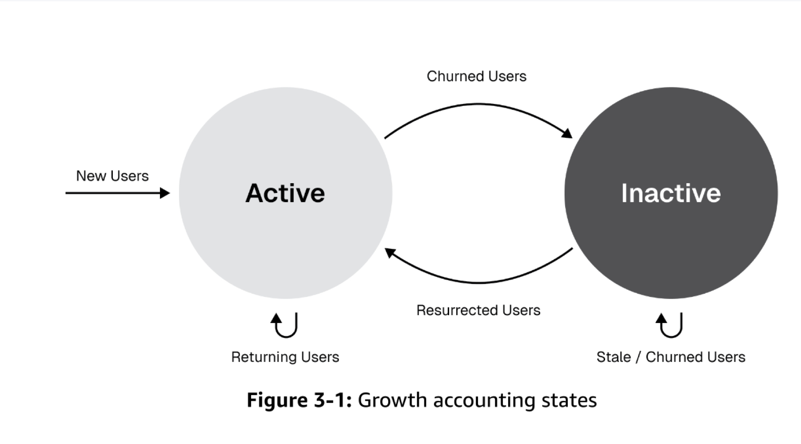
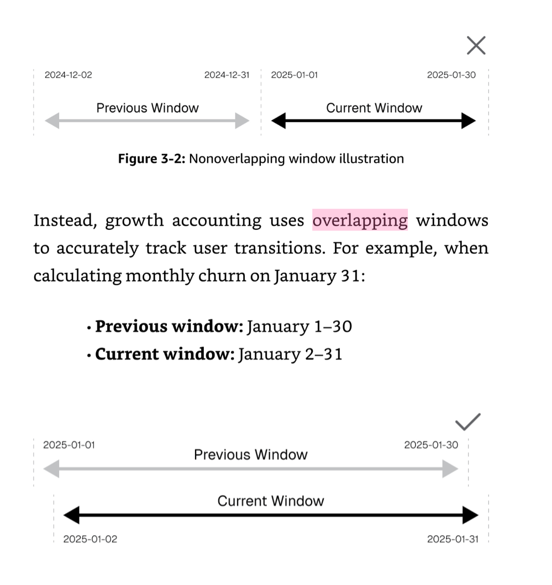

# 当 MAU 停滞但买量不停：用 Growth Accounting 拆解增长的"漏水桶"

> **角色：** Data Analyst，移动支付 Fintech（尼日利亚市场）
> **工具：** SQL (Hive/SparkSQL, 窗口函数, 自连接)、自动化看板
> **关键词：** Growth Accounting, Overlap Window, 用户状态流转, Churn 归因, MAU 拆解

---

## 摘要

产品的高速增长阶段正在明显放缓，ROI 在下降。买量花了很多钱，每天进大批新客，但月末一看大盘 MAU 没怎么涨。

我发现问题在于：**宏观的 MAU 掩盖了微观的用户状态流转**——拉新、留存、召回、流失的指标各自为战，没有被联动。

我主动引入 **Growth Accounting 框架**，使用 **Overlap Window（重叠窗口）** 方法将 MAU 强制拆解为 New / Retained / Resurrected / Churned 四个物理分量，实现了**天级精确归属**。基于此发现某网盟渠道 New Users 虽多但次月 Churn 异常偏高，直接为削减劣质渠道预算提供了数据靶点。

---

## 一、背景：买量投入 vs. MAU 停滞的矛盾

### 业务痛点

作为流量分发与平台拉新团队的数据分析师，我日常接触大量广告买量增长数据。当时面临的核心矛盾：

- **现象**：每天通过各渠道获取大批新客，买量预算持续投入
- **结果**：月末盘点时，大盘 MAU 几乎没涨
- **疑问**：钱花到哪里去了？用户都去哪儿了？

### 我看到的问题

翻看之前的月报，我发现虽然团队有关于拉新、留存、召回、流失的各项指标，但存在根本性缺陷：

!!! warning "指标体系的断裂"
    - 拉新团队看 New Users，留存团队看 Retention Rate，流失团队看 Churn Rate——**各自为战**
    - MAU 仅仅是一个单独的数字，没有被分解为组成部分
    - **没有人在追踪用户状态之间的流转动态**

换句话说：**宏观的 MAU 掩盖了微观的用户状态流转。**

---

## 二、降维破局：Growth Accounting 框架

### 核心思想

为了打破这个黑盒，我利用已有的埋点数据，定义了清晰的用户状态体系：

- **单位**：Users
- **活跃定义**：Pay action（支付行为）
- **四种状态**：New → Retained → Churned → Resurrected



任意时刻的活跃用户（XAU）可以被**强制拆解**为三个来源：

\[
XAU_{t} = \text{New}_{t} + \text{Retained}_{t} + \text{Resurrected}_{t}
\]

而每日的 MAU 净增长则是：

\[
\text{Net Growth} = (\text{New} + \text{Resurrected}) - \text{Churned}
\]

### 反常识发现

框架搭建后的第一个发现就令人震惊：**Acquire（获客）量很大，但 Churn（流失）也同样巨大**——净增长被高流失吞噬。MAU 没涨不是因为拉新不够，而是因为**留不住人**。

---

## 三、Overlap Window：从月级模糊到天级精确

### 传统方法的问题

传统月维度口径（如"1月活跃 vs. 2月活跃"）的问题在于：用户状态归属不精确，无法追踪每天的流转细节。一个用户在月初流失和月末流失，在传统口径下完全无法区分。

### 我的方法：重叠窗口

我放弃传统的非重叠月度对比，改为采用 **Overlapping Windows** 的滚动追踪机制——例如，以"1月1-30日"对比"1月2-31日"，两个窗口仅相差一天：



### 边界状态的精准捕获

这个框架最强大的地方在于**边界状态的精准捕获**：

| 场景 | 窗口表现 | 含义 | 状态判定 |
| :--- | :------- | :--- | :------- |
| 用户仅出现在新窗口（1.2-1.31） | "专属于 01-31" | 要么是首次出现（New），要么是回归（Resurrected） | 通过 `first_time` 标记区分 |
| 用户两个窗口都有 | 不专属于任何一天 | 在 01-31 窗口仍为 Retained | Retained |
| 用户仅出现在旧窗口（1.1-1.30） | 从新窗口消失 | 流失——且由于窗口仅差一天，可精确定位到**最后活跃日为 1月1日** | Churned |

**精确 Churn 定位的威力：**

当一个用户出现在"1.1-1.30"的窗口中，却从"1.2-1.31"的窗口消失时，在数学上绝对意味着：**该用户近 30 天的唯一活跃点是 1月1日**。这使得我们能够对每日产生的 Churn 用户进行精确到天的**滞后归因（Delayed Attribution）**——进一步追溯到该用户的获客渠道、当天参与的活动、使用的功能等。

**瞬时流量脉冲的识别：**

同样，如果用户"专属于 01-31"窗口（仅在这一天活跃），这代表着**瞬时流量脉冲**。如果他们是 New，可以定位到精确的获客渠道评估质量；如果是 Resurrected，说明当天某条召回策略极其精准。

---

## 四、工程落地：SQL 实现

面对千万级的日活埋点数据，我使用 SQL（窗口函数与自连接）处理时间偏移序列，精准打标每个用户的状态跃迁（State Transition），并构建了底层的自动化数据管道。

### 核心逻辑伪代码

```sql
WITH window_current AS (
    -- 以 anchor_date 为基准，取过去30天内有支付行为的用户
    SELECT DISTINCT user_id
    FROM user_activity
    WHERE dt BETWEEN DATE_SUB(anchor_date, 29) AND anchor_date
      AND event_type = 'pay'
),
window_previous AS (
    -- 以 anchor_date - 1 为基准，取过去30天内有支付行为的用户
    SELECT DISTINCT user_id
    FROM user_activity
    WHERE dt BETWEEN DATE_SUB(anchor_date, 30) AND DATE_SUB(anchor_date, 1)
      AND event_type = 'pay'
),
user_first AS (
    -- 每个用户的首次活跃日
    SELECT user_id, MIN(dt) AS first_active_date
    FROM user_activity
    WHERE event_type = 'pay'
    GROUP BY user_id
)
SELECT
    anchor_date,
    CASE
        WHEN c.user_id IS NOT NULL AND p.user_id IS NOT NULL THEN 'Retained'
        WHEN c.user_id IS NOT NULL AND p.user_id IS NULL
             AND f.first_active_date = anchor_date THEN 'New'
        WHEN c.user_id IS NOT NULL AND p.user_id IS NULL
             AND f.first_active_date < anchor_date THEN 'Resurrected'
        WHEN c.user_id IS NULL AND p.user_id IS NOT NULL THEN 'Churned'
    END AS user_state,
    COUNT(*) AS user_count
FROM window_current c
FULL OUTER JOIN window_previous p ON c.user_id = p.user_id
LEFT JOIN user_first f ON COALESCE(c.user_id, p.user_id) = f.user_id
GROUP BY 1, 2;
```

产出的自动化看板支持：

- 每日用户状态流转追踪
- Churn 用户的渠道来源归因
- 各渠道 / 活动的 Retain 效果对比

---

## 五、业务价值：定位"漏水点"

基于此底层数据，我搭建了针对拉新渠道的**"用户资产流转看板"**。

!!! success "核心发现"
    后续对近期数据深入拆解发现：**某些网盟渠道虽然带来的 New Users 多，但其次月转化为 Churned 的比例异常偏高**。

这直接协助用户增长团队定位到了"漏水点"：

| 维度 | 发现 | 行动 |
| :--- | :--- | :--- |
| **渠道质量** | 网盟渠道 A 的 New→Churn 转化率是主流渠道的 2.5 倍 | 削减该渠道预算 |
| **留存策略** | Resurrected 用户的 7 日再流失率高达 45% | 优化召回后的承接流程 |
| **买量 ROI** | 真实 "净获客" 远低于 "毛获客" | 调整 ROI 计算口径，纳入 Churn 成本 |

这些发现为后续削减劣质渠道预算、优化留存策略提供了直接的数据靶点，也为团队的渠道买量优化指明了方向。

---

## 六、反思：这个项目展示了什么？

| 维度               | 本案例展示的能力                                                  |
| :----------------- | :--------------------------------------------------------------- |
| **主动性**         | 不是等业务方提需求，而是自主发现指标体系的断裂并主动引入框架       |
| **指标思维**       | 从单一 MAU 数字到四分量拆解，重新定义了团队看增长的方式           |
| **工程能力**       | 用 SQL 窗口函数处理千万级数据，构建可复用的自动化管道             |
| **业务判断力**     | 从数据中识别"漏水桶"模式，将分析连接到预算决策                   |
| **框架化思维**     | 将散乱的日常指标整合为一套可解释、可追踪的统一框架                |
