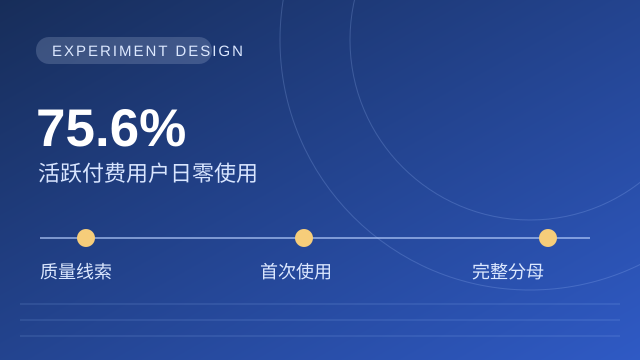
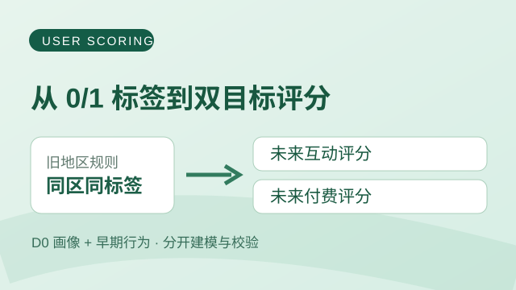
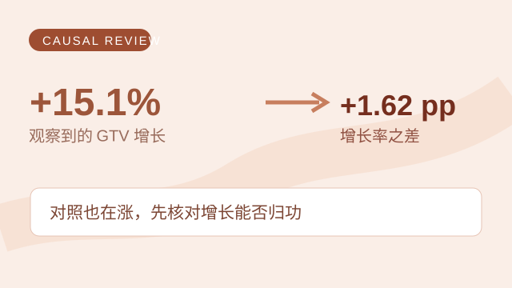

---
hide:
  - navigation
  - toc
---

SELECTED WORK

# 项目案例

每个案例围绕一个具体判断：先交代问题和结论，再展开证据、方法与局限。

{ .case-cover-link }

01 / 实验设计 · 因果判断

### [Super Like：验证首次使用策略](feature-causal.md)

核心动作：分析使用分布，设计首次使用实验，锁定完整目标人群。

关键判断：Match 后质量只是线索；决策看全体目标用户的深聊增量。

[查看案例 →](feature-causal.md)

{ .case-cover-link }

02 / 规则审计 · 预测建模

### [高价值用户：双目标评分](is-great.md)

核心动作：审计地区规则，分别建模预测未来互动与付费。

关键判断：同地区用户仍有差异；互动与付费需要分别排序。

[查看案例 →](is-great.md)

{ .case-cover-link }

03 / 准实验 · 效果评估

### [ANR 策略：审视 +15% 的增长](anr-optimization.md)

核心动作：核对处理时点与样本，用同期对照拆开发薪前后的增长。

关键判断：对照也涨 13.5%；+1.62 pp 的增长率差，仍依赖比例趋势与发薪可比性。

[查看案例 →](anr-optimization.md)

## 更多案例

04 / 用户增长

### [Overlap Window：追踪 MAU 每天的进出](growth-accounting.md)

让相邻 30 天窗口只移动一天，把每日净变化落到用户，再追到渠道与支付批次。

05 / 渠道质量

### [广告渠道反作弊：36 个子渠道的同一种异常](ad-channel-analysis.md)

从归因时间异常出发，结合跨平台基线与漏斗分析评估渠道质量。

[阅读文章与工具复盘 →](../blog/index.md)

